# 📈 Cryptocurrency Investment Advisor Bot
Telegram‑бот, который помогает пользователям следить за рынком криптовалют, управлять своим инвестиционным портфелем и получать аналитику с помощью LLM-советника (OpenRoute).

Документы с подробным описанием требований и архитектуры находятся в каталоге [`docs/`](docs/).

---

## 🔗 Ссылки
- **Репозиторий GitHub**: [Cryptocurrency-Investment-Advisor-Bot](https://github.com/Java-Team-Spring-Framework/Cryptocurrency-Investment-Advisor-Bot)
- **Telegram бот**: [@javacryptomknbot] 
- **Docker Hub образ**: 

---

## 📋 Технологический стек

- **Язык**: Java 25
- **Фреймворк**: Spring 7 (Reactive Spring / WebFlux, JOOQ, Spring Rest Docs)
- **База данных**: PostgreSQL 18.3
- **Брокер сообщений**: RabbitMQ
- **Источники данных**: Binance API (курсы криптовалют)
- **LLM провайдер**: OpenRoute API
- **Telegram API**: Java Telegram Bot API
- **Контейнеризация**: Docker, Docker Compose
- **Сборка**: Gradle (fat‑JAR)
- **Логирование**: SLF4J

---

## 💡 Основные функции

1. **Мониторинг курсов и фиатных валют**
   - Настройка криптовалюты по умолчанию (BTC) и фиатной валюты (USD).
   - `/price_crypto` — текущая цена криптовалюты в выбранном фиате.
   - `/price_history` — история изменения цены за 1, 7 или 30 дней.
   - `/compare` — сравнение цен двух криптовалют.
   - Поддерживаемые фиаты: USD, EUR, JPY, GBP, TRY, RUB, CNY.
   - Поддерживаемые криптовалюты: BTC, ETH, SOL, XRP, ADA, DOGE, AVAX, NEAR, LTC.

2. **Управление инвестиционным портфелем**
   - `/portfolio_add` и `/portfolio_remove` — добавление и удаление активов.
   - `/portfolio` — просмотр состава портфеля и его текущей стоимости.
   - `/portfolio_amount` — общая оценка портфеля.
   - `/portfolio_history` — изменение стоимости портфеля за 1 день, 1 месяц или 1 год.
   - `/portfolio_crypto_history` — изменение стоимости каждого актива с момента покупки.

3. **Система уведомлений (Алерты)**
   - `/set_alert` — создание пользовательского алерта (по достижению целевой цены или по изменению в %).
   - `/alerts_list` — список активных алертов.
   - `/delete_alert` — удаление алерта.
   - Автоматические уведомления о колебаниях на 5% за последние 24 часа для отслеживаемых валют.
   - `/alerts` — просмотр сработавших уведомлений за последние 7 дней.

4. **ИИ-аналитика (LLM)**
   - `/llm_analyze <тикер>` — инвестиционный анализ конкретной монеты.
   - `/llm_portfolio` — ревью вашего текущего портфеля с рекомендациями.
   - `/llm_ask <вопрос>` — свободный запрос ИИ-советнику по теме криптовалют.

---

## ⚙️ Требования к окружению

- **Docker** 20.10+ и **Docker Compose** 2.20+
- **Java 25** и **Gradle Wrapper** (`gradlew.bat`/`gradlew`) — для сборки и локального тестирования.

---

## 🔧 Настройка переменных окружения

Создайте в корне проекта файл **`.env`**:

```env
# Telegram Bot

TELEGRAM_BOT_TOKEN=ваш_токен_от_BotFather

# OpenRoute API (LLM)
OPENROUTE_API_KEY=ваш_api_ключ_openroute

# Секретный токен для HTTP API (Admin)
API_TOKEN=ваш_секретный_токен_администратора

# Порт сервера
SERVER_PORT=8080
```


---

## 🚀 Запуск через Docker

Убедитесь, что файл `.env` создан и Docker (Docker Desktop) запущен.

#### 1. Сборка fat‑jar (через Gradle)

Для Windows:
```powershell
.\gradlew.bat build -x test
```
Для Linux/Mac:
```bash
./gradlew build -x test
```

#### 2. Запуск контейнеров (Приложение + PostgreSQL + RabbitMQ)

```powershell
docker-compose up --build -d
```

Если образ приложения уже собран:
```powershell
docker-compose up -d
```

#### 3. Проверка логов приложения

```powershell
docker-compose logs -f app
```

#### 4. Остановка и очистка данных

```powershell
docker-compose down            # Остановить контейнеры
docker-compose down -v         # Остановить и удалить volumes (очистить БД)
```

---

## 🖥 Локальный запуск (для разработки)

#### 1. Поднимите только инфраструктуру

Если в вашем `docker-compose.yml` вынесены базы данных, вы можете запустить только их:
```powershell
docker-compose up -d db rabbitmq
```

#### 2. Установите переменные окружения

В PowerShell:
```powershell
$env:TELEGRAM_BOT_TOKEN = "ваш_токен"
$env:OPENROUTE_API_KEY  = "ваш_ключ"
$env:API_TOKEN          = "токен_админа"
```

#### 3. Запустите приложение

```powershell
.\gradlew.bat bootRun
```

---

## 🖼 Взаимодействие с ботом (Список команд)

- `/start` — Инициализация, регистрация
- `/menu` — Показать главное меню (кнопки).
- `/set_fiat` — Выбор фиатной валюты.
- `/current_fiat` — Показать текущую фиатную валюту.
- `/add_tracked_crypto` — Добавить крипту в отслеживаемые (с установкой порога уведомления).
- `/remove_tracked_crypto` — Удалить крипту из отслеживаемых.
- `/tracked` — Показать список отслеживаемых криптовалют.
- `/price_crypto` — Посмотреть текущую цену криптовалюты.
- `/price_history` — История изменения цены за период.
- `/compare` — Сравнение двух криптовалют.
- `/portfolio_add` — Добавить актив в портфель.
- `/portfolio_remove` — Удалить актив из портфеля.
- `/portfolio` — Просмотр текущего состава портфеля.
- `/portfolio_amount` — Общая стоимость портфеля.
- `/portfolio_history` — Изменение стоимости портфеля (1 день, 1 месяц, 1 год).
- `/portfolio_crypto_history` — Изменение стоимости каждой монеты с момента добавления.
- `/set_alert` — Установить пользовательский алерт (по цене или проценту).
- `/alerts_list` — Просмотр активных алертов.
- `/delete_alert` — Удаление алерта по ID.
- `/alerts` — Просмотр истории сработавших уведомлений (за 7 дней).
- `/llm_analyze <тикер>` — Инвестиционный анализ монеты.
- `/llm_portfolio` — Ревью портфеля с помощью ИИ.
- `/llm_ask <вопрос>` — Задать любой вопрос о крипторынке.
- `/help` — Вызов справки по командам.

---

## 🔌 HTTP эндпоинты (Администрирование)

Система предоставляет REST API для мониторинга и управления администратором:

1. **Проверка работоспособности системы (Public)**
   - **Метод**: `GET http://localhost:8080/healthcheck`
   - **Авторизация**: Не требуется.
   - **Описание**: Возвращает статус приложения.

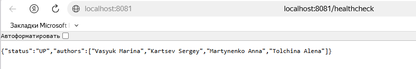

2. **Получение списка пользователей (Admin Only)**
   - **Метод**: `GET http://localhost:8080/admin/users`
   - **Авторизация**: Требуется HTTP-заголовок `Authorization: Bearer <API_TOKEN>`
   - **Описание**: Возвращает массив зарегистрированных пользователей. Запросы без валидного ключа отклоняются.

---

## Пример взаимодействия с ботом

- `/start` 


- `/set_fiat` 

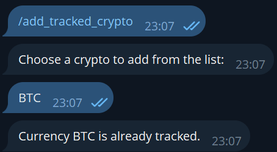

- `/current_fiat` 

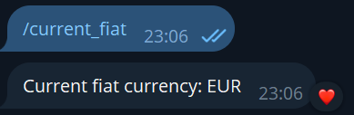

- `/add_tracked_crypto` 

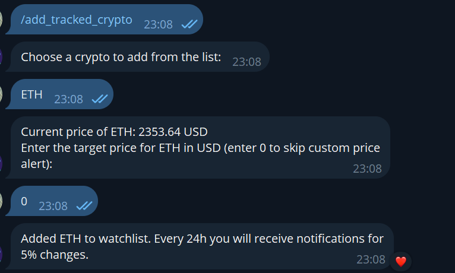

- `/remove_tracked_crypto` 

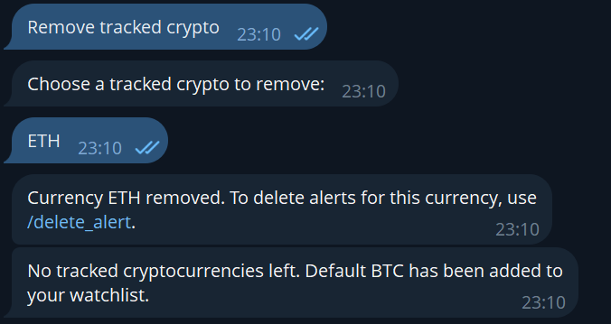

- `/tracked` 

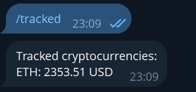

- `/price_crypto` 

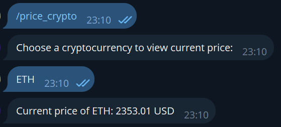

- `/price_history` 

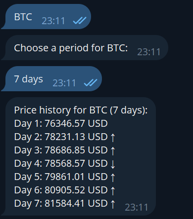

- `/compare` 

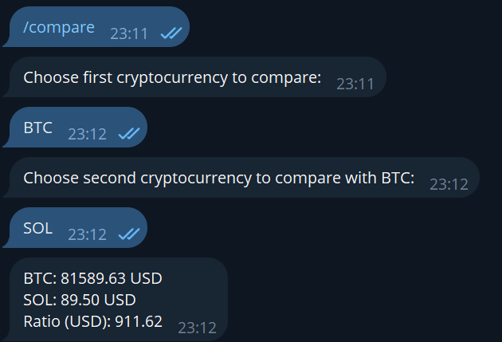

- `/portfolio_add` 

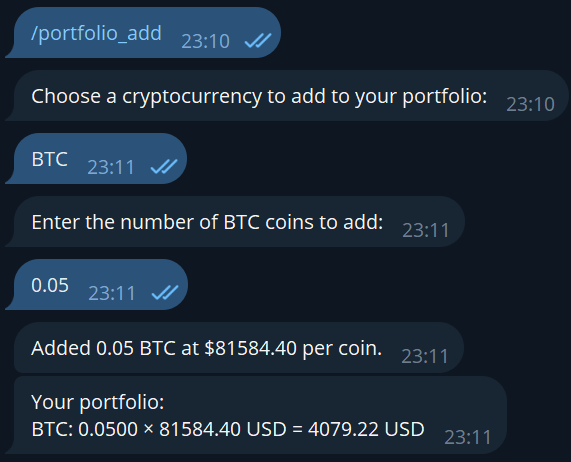

- `/portfolio_remove`

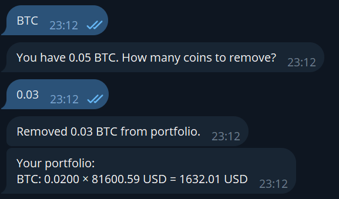

- `/portfolio` 

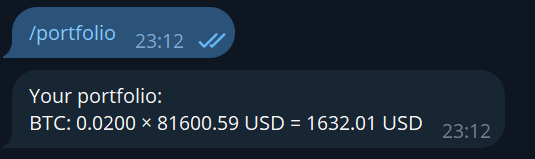

- `/portfolio_amount`

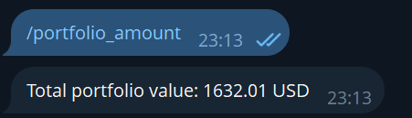

- `/portfolio_history` 

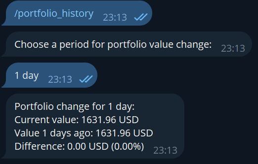

- `/portfolio_crypto_history` 

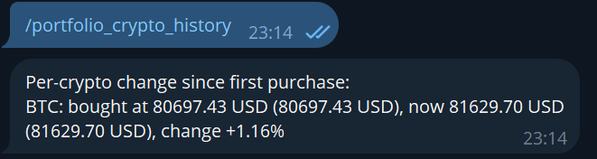

- `/set_alert` 

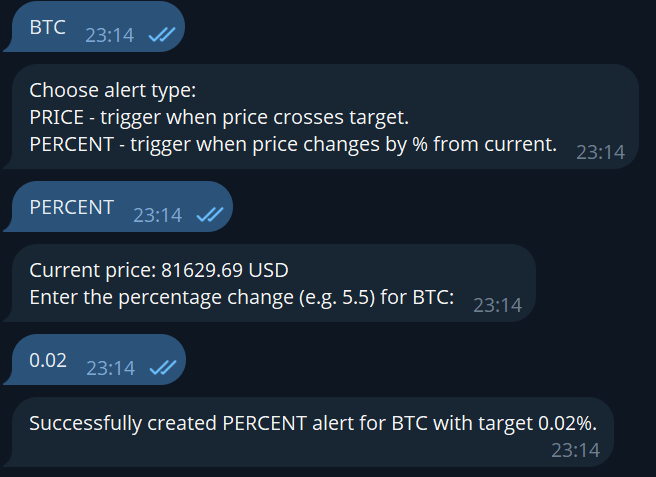

- `/alerts_list` 

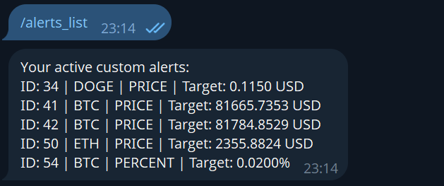

- `/delete_alert` 

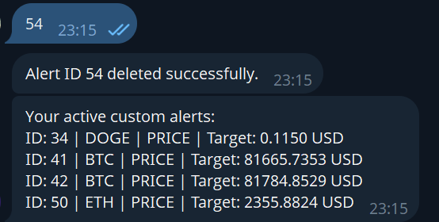

- `/alerts` 

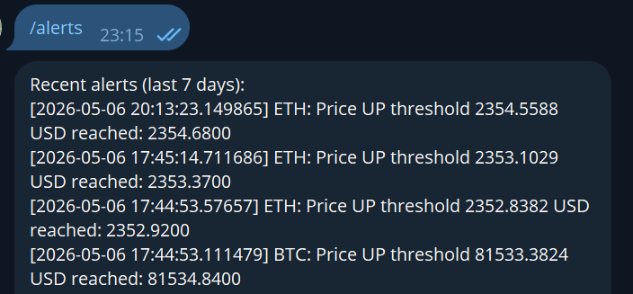

- `/llm_analyze <тикер>` 

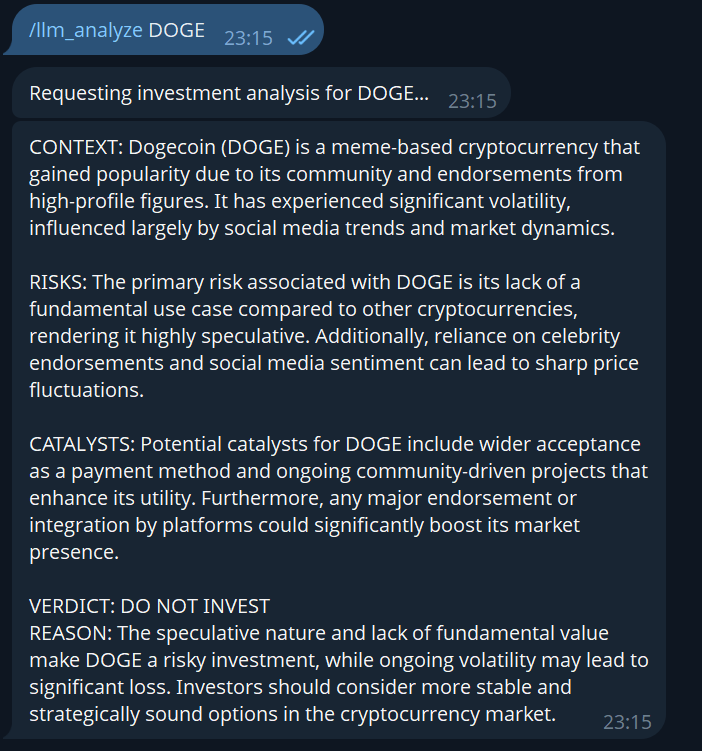

- `/llm_portfolio` 

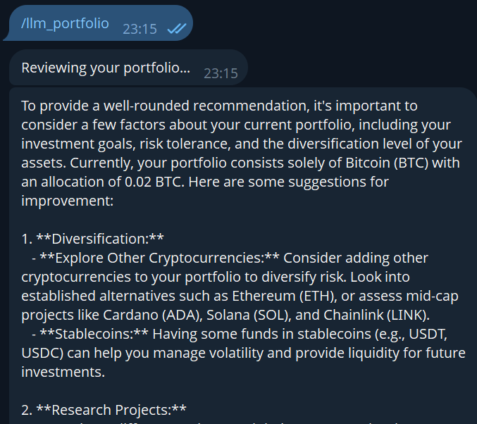

- `/llm_ask <вопрос>` 

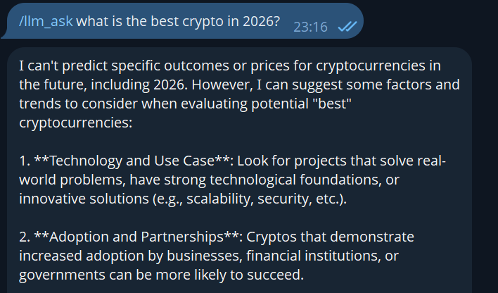


## 📁 Основные модули системы

- **TelegramBotService** — обработка входящих команд Telegram, маршрутизация и UI (кнопки).
- **CryptoInformationModule** — интеграция с Binance API, курсы, отслеживаемые валюты, история цен.
- **PortfolioManagementModule** — управление инвестиционным портфелем пользователя и расчет PnL.
- **AlertsHandlingModule** — логика создания, проверки (с помощью RabbitMQ) и отправки уведомлений.
- **MessageHandlingModule** — интеграция с OpenRoute API для генерации ответов ИИ-советника.
- **AuthUserModule / AuthAdminModule** — идентификация пользователей (по chat_id) и проверка ключа администратора.
- **FiatConversionService** — конвертация фиатных валют по актуальным кросс-курсам.


